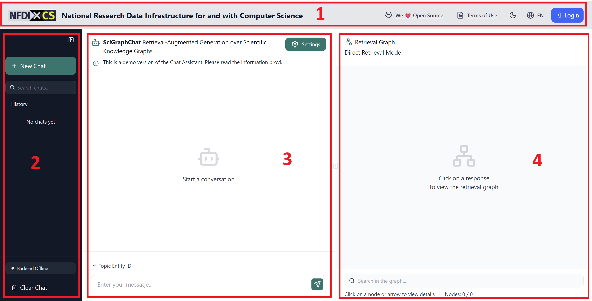
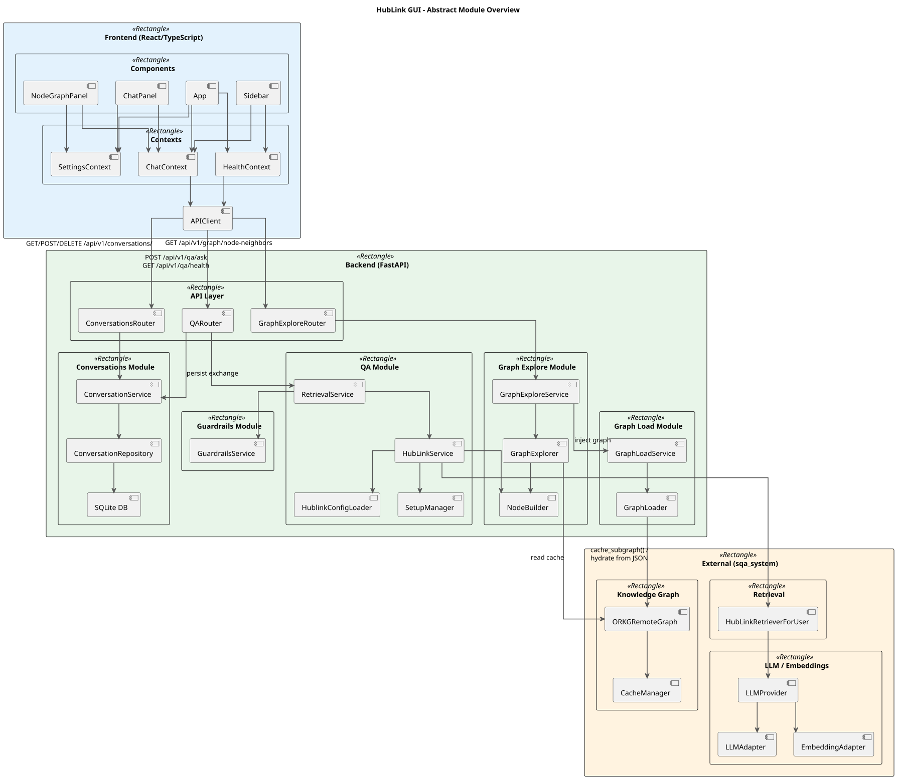

# Developer Guide
Practical Course | Xiyu Zhong
## Features

{width=900 height=459}

The app is divided into four fields. Each field corresponds to a component in `frontend/src/components/`.

### 1. Header
> **Login — not yet implemented.**

- **App settings** — access global application preferences.

### 2. Session Field (Sidebar)
Manage your chat sessions in the left sidebar.

### 3. Chat Field
Main chat field.

**Chat settings** let you configure the retrieval pipeline for each query:

| Setting | Options |
|---|---|
| Retrieval strategy | **Direct** — vector similarity search; **Graph** — graph traversal |
| LLM model | Gemma2-9B, Gemma3-4B, Qwen3-Latest, Llama3.1-8B (open-source) · o3, o3-mini, GPT-4o, GPT-4o-mini (proprietary) |
| Number of hubs | 10, 20, or 30 |

### 4. Graph Field
Displays the knowledge graph relevant to the last answer, and lets you explore it interactively.

| Action | How |
|---|---|
| View graph for an answer | After receiving an answer, the graph panel shows the subgraph of retrieved knowledge |
| Graph exploration | Select a node and click to expand its neighbouring nodes, click again to shrink |
| Search the graph | Search a certain node or edge by label or ID |

## Architecture Overview

{width=690 height=600}

The app follows a **modular backend architecture**. Each capability is an isolated module under `implementation/backend/app/modules/`. The diagram above shows how modules relate to each other and to shared infrastructure.

The backend uses a **modular architecture**. All business logic lives under `implementation/backend/app/modules/`, with one directory per capability:

```text
app/modules/
├── qa/             # Question-answering via the HubLink retrieval pipeline
├── conversations/  # Conversation management (create, list, delete, history)
├── graph_explore/  # Graph traversal — neighbouring nodes for a given entity
├── graph_load/     # Loads the ORKG knowledge graph into cache at startup
└── guardrails/     # Input/output validation (gibberish, jailbreak, toxic language)
```

---

#### Module structure

Each module follows a **three-layer layout**:

```text
<module>/
├── api/
├── application/
├── infrastructure/
│   └── <provider>/
└── __init__.py
```

| Layer | Responsibility |
|---|---|
| `api/` | Defines HTTP routes and translates HTTP ↔ domain objects. Depends on `application/`. |
| `application/` | Orchestrates business logic. Has no knowledge of HTTP or external systems. |
| `infrastructure/` | Does the actual I/O: database queries, ORKG REST calls, HubLink retrieval, cache reads/writes. |

The layers are themselves modular — include only what a module needs, and add extra directories when required:

- `graph_load` omits `api/` — it runs at startup, wired via dependency injection in `core/dependencies.py`.
- `guardrails` omits both `api/` and `infrastructure/` — it contains only pure validation functions called by other modules.
- `qa` adds a `configs/` directory alongside the standard layers for HubLink JSON configuration files.

---

#### Adding a new module

1. **Create the module directory** under `app/modules/<your_module>/` following the three-layer layout above.

2. **Implement the layers** bottom-up:
   - `infrastructure/` — write the integration with any external system.
   - `application/` — write the service class that calls the infrastructure and contains the business logic.
   - `api/` — define a FastAPI `APIRouter`, import the service, and expose HTTP endpoints.

3. **Register the router** in `app/core/module_registry.py` by adding your router to the list of included routers. This wires your endpoints into the main FastAPI app.

4. **Wire dependencies** in `app/core/dependencies.py` if your module needs startup logic or shared dependencies.

5. **Add tests** — module-level tests go in `modules/<your_module>/tests/`, cross-module tests in `backend/tests/`.

**Useful references inside the codebase:**

- `app/shared/` — reusable utilities (logging helpers, base classes, etc.) with no module-specific assumptions. Prefer these over duplicating logic.
- `app/contracts/` — shared request/response schemas used by more than one module.
- `app/core/module_registry.py` — where all routers are registered.

---

## Tech Stack

### Docker

The stack is defined in `implementation/docker-compose.yml` and consists of two services:

| Service | Image base | Port |
|---|---|---|
| `backend` | Python 3.12-slim | 8000 (internal only) |
| `frontend` | Node 20 | 3000 (public) |

Key design decisions:

- **Source bind-mounts** — both services mount their source directory into the container, so code changes take effect via hot-reload without a rebuild. An earlier version also used a named volume (`hublink_cache`) to persist the HubLink cache data. This was dropped: during development the cache changes (different naming, re-runs of `init_graph_cache.py`), and updating a named volume's contents requires tearing it down (`docker compose down -v`) and reinitialising — effectively rebuilding the cached data from scratch each time. Leaving the cache inside the bind-mounted source tree makes it a plain host-side file that can be updated freely.

- **Root user in the backend container** — the backend runs as `root` inside the container. The path to this decision went through two failed attempts:
  1. The container originally ran as non-root `appuser`. Guardrails Hub installs validators at build time and writes a `hub_registry.json` to `/root/.guardrails/`, which `appuser` cannot read.
  2. The workaround was to copy the registry into `/app/.guardrails/` during the build and `chown` it to `appuser`. This also failed: the `.:/app` bind-mount replaces the entire `/app` directory at runtime, hiding everything placed there during the build — including the copied registry. 

---

### Frontend

| Concern | Technology |
|---|---|
| Framework | React 18 + TypeScript |
| Build/dev server | Vite (serves on port 3000) |
| UI components | Radix UI, Tailwind CSS, Lucide icons |
| Visualization | D3.js, Recharts |
| Forms | React Hook Form |
| State management | React Context API |
| API calls | Proxied via Vite to the backend at `/api/*` |

Source lives in `implementation/frontend/src/`:

```text
src/
├── components/      # UI components
├── contexts/        # React Context providers
├── services/        # API call layer
├── hooks/           # Custom React hooks
├── types/           # TypeScript type definitions
└── styles/          # CSS utilities
```

---

### Backend

| Concern | Technology |
|---|---|
| Framework | FastAPI + Uvicorn (port 8000) |
| Language | Python 3.12 |
| Data validation | Pydantic v2 |
| Database | SQLite via SQLAlchemy 2 + aiosqlite |
| Safety layer | Guardrails AI (toxic language, jailbreak detection) |
| Retrieval pipeline | HubLink (LangChain, ChromaDB, ORKG client, RDFlib) |
| LLM backends | Ollama (local) or OpenAI API |

Source lives in `implementation/backend/app/`:

```text
app/
├── core/            # Config, dependency injection, logging, module registry
├── contracts/       # Shared request/response schemas
├── shared/          # Reusable utilities with no module-specific assumptions
├── modules/         # Domain modules (see "How to add new features?" below)
└── main.py          # FastAPI application entry point
```

---

## How to configure default settings of hublink retriever?
For a detailed configuration reference, see `backend/app/modules/qa/README.md`.

---

## Useful Docker commands after changing code

Because source code is bind-mounted into the containers, **most changes take effect automatically** via hot-reload — no rebuild needed.

A rebuild is only required when you change:
- A `Dockerfile`
- `pyproject.toml` or `requirements.txt` (Python dependencies)
- `package.json` or `package-lock.json` (Node dependencies)

| Scenario | Command |
|---|---|
| First start, or after `Dockerfile`/dependency changes | `docker compose up --build` *(requires `GUARDRAILS_TOKEN`)* |
| Normal restart — code changes only, hot-reload active | `docker compose up` |
| Rebuild only the backend image | `docker compose build backend` *(requires `GUARDRAILS_TOKEN`)* |
| Stop all services | `docker compose down` |
| Stop and remove volumes | `docker compose down -v` |
| Stream logs from all services | `docker compose logs -f` |
| Stream backend logs only | `docker compose logs -f backend` |
| Stream frontend logs only | `docker compose logs -f frontend` |

All commands should be run from `implementation/`.

---

## Future TODOs

- **Graceful handling of off-topic inputs** — questions that are not relevant to retrieval but are not harmful (e.g. "Hi!", small talk). Currently these produce unexpected responses.
- **Graph visualisation** — better automatic layout for nodes and edges in the graph view.
- **CI/CD pipeline** - A basic CI file containing only the test stage has been created [.gitlab-ci.yml]. It can be extended further as needed.
- **User management** — registration and login, so conversations are tied to a user account. The conversations module currently has no user ownership; the existing SQLite schema would need to migrate to PostgreSQL with Alembic.
- **Improvement on HubLink retrieval quality**
- **Retrieval quality on other datasets** - explore hublink retrieval on different datasets.

---

# User Guide

## How to start the Docker image of the app?

### Prerequisites

- [Docker Desktop](https://www.docker.com/products/docker-desktop/) (or Docker Engine + Compose plugin)

---

### 1. Create environment files

From `src/xiyuzhong/implementation/`, copy the example files and fill in your credentials:

```powershell
Copy-Item backend/.env.example backend/.env
Copy-Item frontend/.env.example frontend/.env
```

Open `backend/.env` and fill in at least these four values:

```env
ORKG_EMAIL=<your ORKG sandbox email>
ORKG_PASSWORD=<your ORKG sandbox password>
OPENAI_API_KEY=<your OpenAI API key>
VDL_API_KEY=<your VDL endpoint token>
```

> Do **not** commit `backend/.env` — it contains secrets.

---

### 2. Set the Guardrails token

The backend Docker image installs Guardrails Hub validators at build time. This requires a `GUARDRAILS_TOKEN`.

Copy the root env example and fill in your token:

```powershell
Copy-Item implementation/.env.example implementation/.env
```

Open `implementation/.env` and set:

```env
GUARDRAILS_TOKEN=<your token>
```

Get or rotate your token at `https://hub.guardrailsai.com/keys`.

---

### 3. Build and start

```powershell
cd implementation
docker compose up --build
```

The first build takes several minutes. The frontend will only become available once the backend health check passes.

---

### 4. Initialize the graph cache (first time only)

Before the backend can answer questions, it needs a local copy of the ORKG knowledge graph. Run this once after the first build:

```powershell
docker compose run --rm backend python backend/init_graph_cache.py
```

This uploads papers from the local dataset to the ORKG sandbox (skipping ones already there) and downloads the subgraph as a local JSON cache. After this runs once, the backend serves from the cache on every subsequent start — no ORKG credentials needed at runtime.

> `ORKG_EMAIL` and `ORKG_PASSWORD` must be set in `backend/.env` for this step.

---

### 5. Open the app
Frontend: http://localhost:3000

---

### Subsequent starts

After the first successful build, you do **not** need to rebuild. Just run:

```powershell
cd implementation
docker compose up
```

`GUARDRAILS_TOKEN` is only required again when the backend image is rebuilt (e.g. after a `pyproject.toml` change or `docker compose up --build`).

---

### Stop the app

```powershell
cd implementation
docker compose down
```

---

### Windows: enable long file path support

This repository contains deeply nested paths that exceed Windows' default 260-character limit. Without this step, Git operations may fail with `Filename too long`.

**1. Enable long paths in Git:**

```powershell
git config --global core.longpaths true
```

**2. Enable long paths in Windows** (admin PowerShell):

```powershell
New-ItemProperty -Path "HKLM:\SYSTEM\CurrentControlSet\Control\FileSystem" `
  -Name "LongPathsEnabled" -Value 1 -PropertyType DWORD -Force
```

After both steps, retry the failing Git operation.